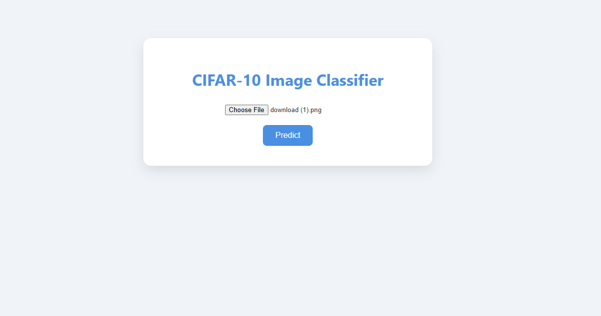

# CIFAR-10 Image Classification with CNN & Flask Web App

## Overview

This project implements a **Convolutional Neural Network (CNN)** to classify images from the **CIFAR-10 dataset** into 10 object categories.  
In addition to model training, a **Flask-based web application** with **HTML & CSS UI** is built to allow **real-time image uploads and predictions by users**.

The project demonstrates the **full machine learning pipeline**, from training to deployment.

---
### Example UI Screenshot



---
## Dataset

- Dataset: **CIFAR-10**
- Total images: **60,000**
  - Training: 50,000
  - Testing: 10,000
- Image size: **32×32 RGB**
- Classes (10):
  - airplane, automobile, bird, cat, deer  
  - dog, frog, horse, ship, truck

Images are normalized to the range **[0, 1]** before training.

---

## Approach

1. Load CIFAR-10 dataset
2. Normalize image pixel values
3. Build a CNN from scratch using Keras
4. Train and validate the model
5. Evaluate performance on test data
6. Visualize predictions
7. Save trained model
8. Deploy model using **Flask**
9. Create a web UI for user image input and prediction

---

## Model Architecture

The CNN architecture consists of:

- Input layer: 32×32×3 RGB images
- Convolutional layers with ReLU activation
- MaxPooling layers for spatial reduction
- Fully connected dense layers
- Output layer with 10 neurons (one per class)


Input (32×32×3)
↓
Conv2D (32 filters) + ReLU
↓
MaxPooling
↓
Conv2D (64 filters) + ReLU
↓
MaxPooling
↓
Conv2D (64 filters) + ReLU
↓
Flatten
↓
Dense (64) + ReLU
↓
Dense (10)

## Training Strategy

The model was trained using a supervised learning approach on the CIFAR-10 dataset.

- Optimizer: Adam
- Loss Function: Sparse Categorical Crossentropy
- Metric: Accuracy
- Epochs: 10

The training process used normalized RGB images and validation on the test dataset to monitor performance.

---

## Results

The trained CNN achieved the following performance on the test dataset:

- **Test Accuracy:** 64.54%
- **Test Loss:** 1.13

These results demonstrate reasonable classification performance for a baseline CNN trained from scratch.

---

## Visualizations

The project includes visual analysis to better understand model behavior:

- Display of sample CIFAR-10 images with class labels
- Comparison of actual vs predicted labels on test images
- Visualization of correct and incorrect predictions

These visualizations help evaluate model learning and prediction quality.

---

## Web Application (Flask UI)

A Flask-based web application was developed to allow real-time interaction with the trained model.

### Features
- Image upload via browser
- Backend preprocessing using TensorFlow
- Real-time prediction using the trained CNN model
- Display of predicted class to the user
- User-friendly interface built with HTML and CSS

---

## Getting Started

Follow the steps below to set up and run the project locally.

---

## Prerequisites

Ensure the following are installed:

- Python 3.8 or higher
- TensorFlow
- Flask
- NumPy
- Matplotlib

---

## Installation

Install the required dependencies using pip:

```bash
pip install tensorflow flask numpy matplotlib


